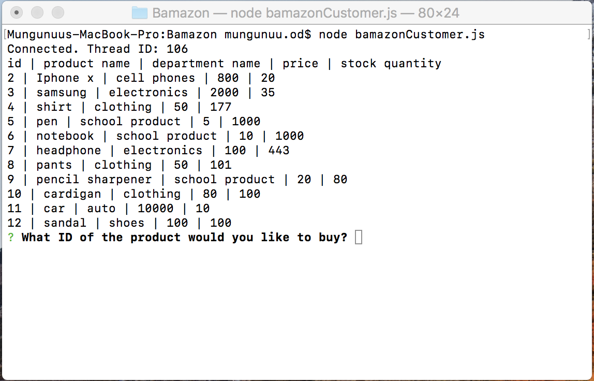
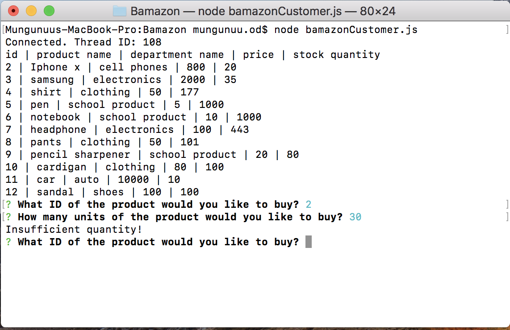
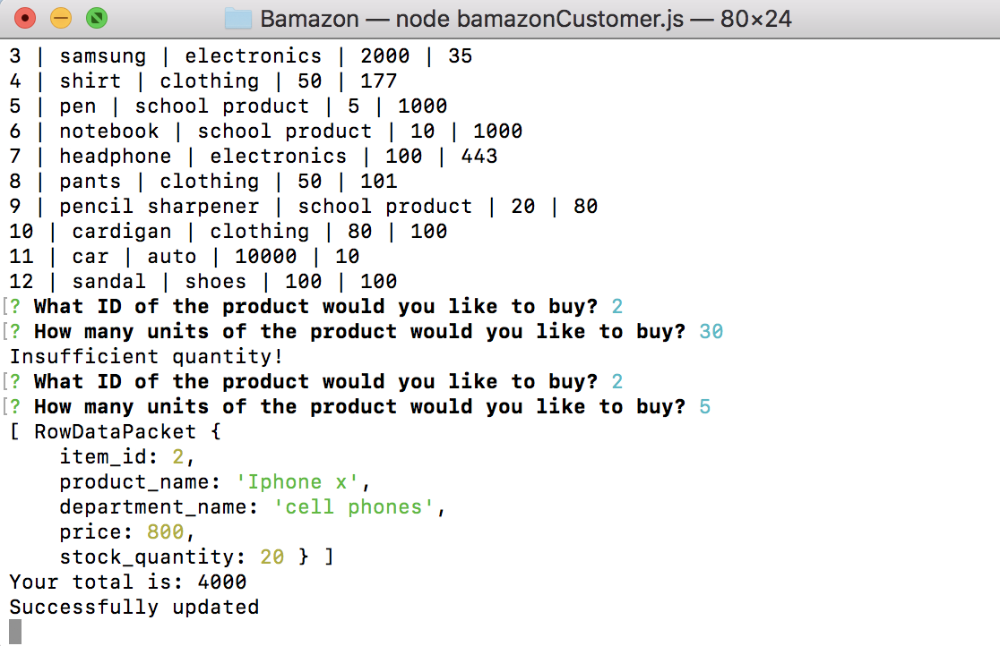
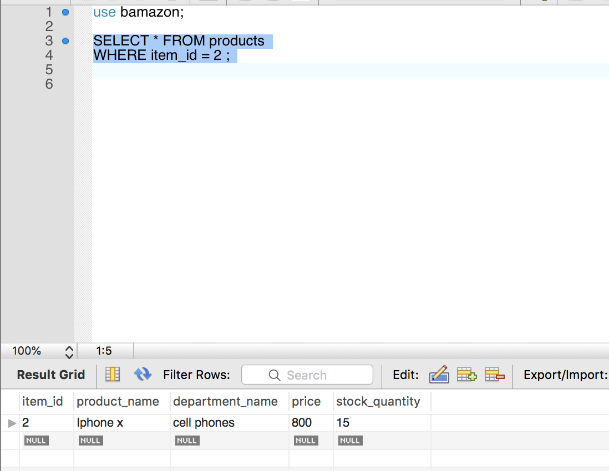

# Bamazon
### Overview
This app will take in orders from customers and deplete stock from the store's inventory.

This is the display all of the items available for sale. Include the ids, names, and prices of products for sale.

This is once the customer has placed the order,  application should check if store has not enough quantity of the product the app should log a phrase like `Insufficient quantity!`, and then prevent the order from going through.

This one is the customer has placed the order,  application should check if store has enough quantity of the product show us the product's information and total cost.

It is the our database to reflect the remainig quantity.

